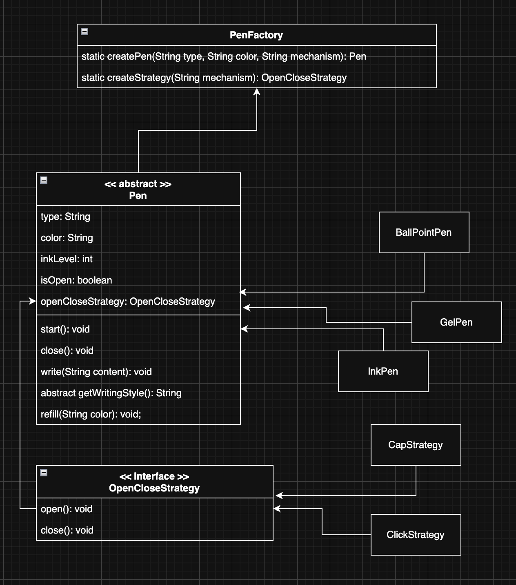

# 🖊️ Pen Design — Object-Oriented Design in Java

A clean, extensible pen system built in Java that demonstrates key OOP design patterns and SOLID principles.

## Overview

This project models different types of pens (BallPoint, Gel, Ink) with interchangeable open/close mechanisms (Cap, Click). The design uses **inheritance** for pen types and the **Strategy Pattern** for open/close behaviour, allowing any pen to be paired with any mechanism without code duplication.

## UML Class Diagram



## Design Patterns Used

| Pattern | Where | Purpose |
|---------|-------|---------|
| **Strategy** | `OpenCloseStrategy` interface with `CapStrategy` / `ClickStrategy` | Decouples the open/close mechanism from the pen itself, making it interchangeable at runtime |
| **Factory** | `PenFactory.createPen()` | Centralises pen creation — the client specifies type, colour, and mechanism as strings without knowing concrete classes |
| **Template Method** | `Pen.write()` calls abstract `getWritingStyle()` | The base class defines the write flow; subclasses only provide their unique writing style |

## SOLID Principles

- **Single Responsibility** — Each class has one reason to change (e.g. `CapStrategy` only handles cap logic).
- **Open/Closed** — New pen types or mechanisms can be added without modifying existing code.
- **Liskov Substitution** — All `Pen` subclasses can be used interchangeably through the `Pen` reference.
- **Dependency Inversion** — `Pen` depends on the `OpenCloseStrategy` abstraction, not concrete strategies.

## Project Structure

```
Pen-new/
├── Pen.java                  # Abstract base class — state, write/refill/start/close logic
├── BallPointPen.java         # Concrete pen — "Rolling ball" writing style
├── GelPen.java               # Concrete pen — "gel" writing style
├── InkPen.java               # Concrete pen — "Nib based fine stroke", custom refill
├── OpenCloseStrategy.java    # Strategy interface — open() / close()
├── CapStrategy.java          # Strategy impl — remove / put cap
├── ClickStrategy.java        # Strategy impl — click open / close
├── PenFactory.java           # Factory — creates pens by type + mechanism strings
├── Main.java                 # Demo client
└── UML.png                   # UML class diagram
```

## Key Features

- **Write** — Outputs content prefixed with pen type, colour, and writing style.
- **Start / Close** — Delegates to the injected `OpenCloseStrategy`; guards against double-open / double-close.
- **Refill** — Resets ink to 100 % and optionally changes colour. `InkPen` overrides this to simulate cartridge replacement.
- **Ink Tracking** — Prevents writing when ink is empty.

## How to Run

```bash
javac *.java
java Main
```

### Sample Output

```
=== BallPoint Pen (Click) ===
Clicking the pen open...
Pen is ready to write
[BallPoint | Blue | Rolling ball] Writing: Hello, World!
[BallPoint | Blue | Rolling ball] Writing: Design Patterns are great.
Clicking the pen close...
Pen is closed.

=== Gel Pen (Cap) ===
Removed the cap...
Pen is ready to write
[Gel | Black | gel] Writing: Smooth gel writing.
Refilling Gel pen with Black ink...
Ink refilled to 100%
[Gel | Black | gel] Writing: Writing after refill.
Putting the cap back on
Pen is closed.

=== Ink Pen (Cap) ===
Removed the cap...
Pen is ready to write
[Ink | Red | Nib based fine stroke] Writing: Fine nib strokes.
Replacing ink cartridge for Ink pen with Red ink...
Ink refilled to 100%
[Ink | Red | Nib based fine stroke] Writing: Writing after cartridge replacement.
Putting the cap back on
Pen is closed.
```

## Extending the Design

**Add a new pen type** — Create a class extending `Pen`, implement `getWritingStyle()`, and register it in `PenFactory`.

**Add a new mechanism** — Create a class implementing `OpenCloseStrategy`, and register it in `PenFactory.createStrategy()`.
# Pen
